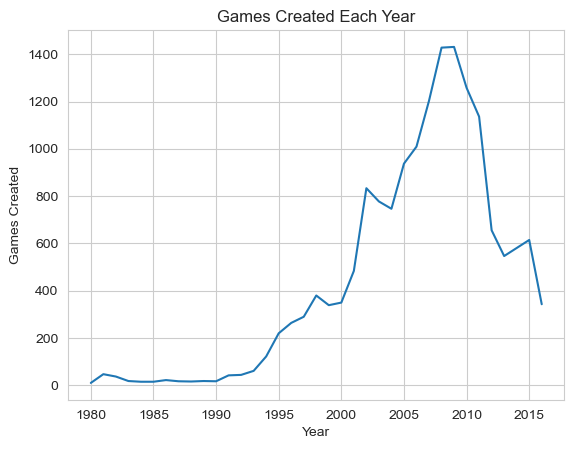
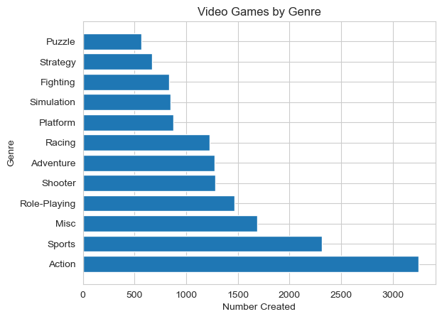
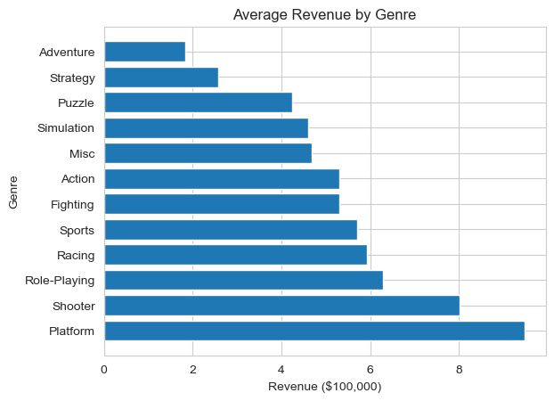
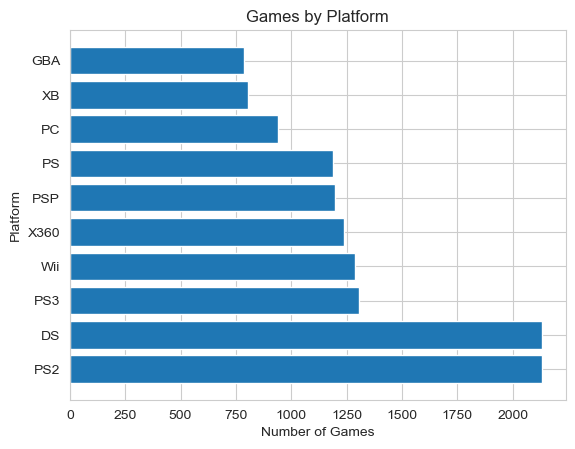

# Analysis and Predictive Modeling of Video Games
Author: Elijah Lopez

## Overview
Video games have gone through a boom and bust period. With the emergence of e-sports and the popularization of competitive gaming and synchronous rise in video game streaming viewership, it seems that the industry is poised for another growth cycle. This analysis focuses on the historical trends in video game development, including popular genres, markets, and platforms.

## Business Problem
Making video games seemed, for a moment, like an easy way to make money. After much craze, the euphoria wore off and game developers are looking for new identities and ways to monetize on their artistic creations. This analysis focuses on historical trends that they can leverage to ensure they are creating and releasing games aligned with public interest and maximize returns. New game developers can also use these insights to learn where best to focus their efforts as they take on global leaders in the industry.

## Data
This video game dataset was posted by GregorySmith on [Kaggle](https://www.kaggle.com/datasets/gregorut/videogamesales) and contains 16,598 games from 1980-2020 with 11 features each. These include name, genre, platform, and sales in various markets. 

## Methods
* There were 271 titles missing the release year and 58 missing publisher information. No other null values.
    * I searched the last four characters of each title and, if numeric, imputed that value as the year for games where there was a null value.
* Because the number of games listed after 2016 was inconsistent, this data was dropped from this analysis.

## Results
### Video Games Over Time

Video games were first released in 1980. Not many games were created annually for the first 15 years. From there, popularity rose until about 2009 with about 1,400 titles being released. Following this time there was was a sharp decline in game creation into the late 2010's. The decline in games created corresponds with a GFC in the USA.

### Video Games by Genre

Action and Sports games are most common
* In 10 out of the 36 years on record Sports games were the most popular
* Overall we see producers focusing on Action games.

### Revenue by Genre

Sales data shows a wide range of values with NA sales making up roughly half of Global sales.
* An average video game makes ~$540k in global sales with top performers in:
    * Platformers
    * Shooters
    * Role-Playing
    * Racing
    * Sports

### Video Games by Platform

The PS2 and Gameboy DS had the most games created by a longshot. This highlights the peak era of video gaming. Despite it's newer, higher performance system we see the PS3 trailing in third in terms of number of games created.

### Predictive Modeling
This dataset was reduced the following predictive features:
* Platform
* Year
* Genre
* Publisher

These were used to estimate Global Sales ($Millions). The data pipeline consisted of creating dummy variables for the categorical data, scaling numeric data, and performing regression analysis. Some of the baseline models used include Linear, Decision Trees, Random Forests, and Suppor Vector Machines. None of these models produced exciting results. Likewise, hyperparameter tuning did not produce desired results. This indicates the need for additional, higher quality estimators of global sales before an effective regression model can be created.

## Conclusions
There is a reason why sports and action games have dominated the video game market for so long. New developers should focus their efforts there in order to compete with market share. If feeling especially creative, a platformer is also a strong choice. These are generally beginner- and kid-friendly and, on average, earn the highest revenue.

## Next Steps
* Obtain more data such as amount spent on video game production, amount spent on marketing, marketing strategy, ESRB rating, release month, and whether or not the game is a sequel in order to more accurately predict global sales.
* Updating the record to be more current would also help developers to stay up to date with trends.

## For More Information
See the full analysis in these Jupyter Notebooks:
* [Exploratory Data Analysis](https://github.com/elijahlopez94/gaming_eda_and_machine_learning/blob/main/video_games_eda.ipynb)
* [Machine Learning](https://github.com/elijahlopez94/gaming_eda_and_machine_learning/blob/main/video_games_ml.ipynb)

For additional info, contact the author at:

Elijah Lopez | elijahlopez94@gmail.com

